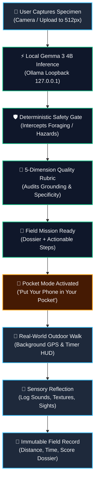
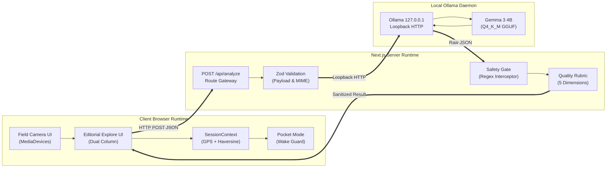
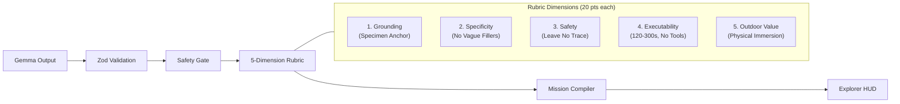
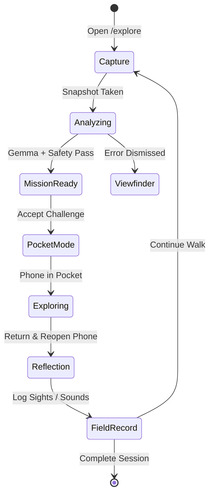

# 🌲 TrailLens

> **Look beyond the screen.**
> An open-source, local-first AI field-experiment engine for outdoor explorers.
> **Hacktoberfest 2026** — Open-Source AI Challenge (Week 1: *Touch Grass*)
> **Target Track:** Partner Category — **Best Use of Gemma**

```text
              TRAILLENS
         LOOK BEYOND THE SCREEN

                 SEE
                  │
                  ▼
        ┌──────────────────┐
        │   GEMMA 3 4B     │
        │  LOCAL INFERENCE │
        └────────┬─────────┘
                 │
                 ▼
        ┌──────────────────┐
        │  FIELD MISSION   │
        │ QUALITY + SAFETY │
        └────────┬─────────┘
                 │
                 ▼
             PHONE DOWN
                 │
                 ▼
          REAL WORLD
          EXPLORATION
                 │
                 ▼
            REFLECTION
                 │
                 ▼
           FIELD RECORD
```

[](https://www.typescriptlang.org/)
[](https://nextjs.org/)
[](https://ollama.com/)
[](https://huggingface.co/google/gemma-3-4b-it)
[](docs/evaluation.md)
[](LICENSE)

---

## ⏱️ In 30 Seconds

| Question | Answer |
| :--- | :--- |
| **What is TrailLens?** | A local-first web application that turns smartphone cameras into outdoor field experiments instead of screen-time traps. |
| **Why does it matter?** | Most nature apps force you to stare at phone screens and fail completely in wilderness areas with zero cellular service. |
| **What is novel?** | It inverts the screen-retention paradigm: one photo yields one timed physical mission (120s–300s), commanding you to put your phone in your pocket. |
| **Why Gemma 3 4B?** | Google's open-weight multimodal model runs locally on device via Ollama, performing rich visual morphology reasoning with zero cloud telemetry. |
| **How does it get users outside?** | Through tactile Pocket Mode, background GPS breadcrumb logging, and a required sensory reflection step before issuing an immutable Field Record. |
| **What evidence exists?** | 100/100 automated tests passing, reproducible local latency benchmarks, and a deterministic 5-dimension quality rubric tested against 10 synthetic fixtures. |

---

## 🧭 The Problem & The Contrarian Idea

### The Problem: The Screen-Retention Trap
Modern mobile applications are designed around dopamine loops, infinite feeds, and persistent screen retention. When hikers take smartphones onto trails, traditional nature apps recreate this behavior:
- Explorers spend minutes reading dense taxonomy cards on a glowing screen while surrounded by living wilderness.
- Cloud-dependent AI engines fail completely the moment cellular reception drops in backcountry trails.
- The direct sensory connection to physical nature is broken.

### The Idea: Local AI as a Tactical Bridge
TrailLens is **not** an AI chatbot, **not** a generic plant identifier, and **not** an engagement dashboard. It is a **Local AI Field-Experiment Engine**:

$$\text{SEE} \longrightarrow \text{GEMMA UNDERSTANDS} \longrightarrow \text{MISSION READY} \longrightarrow \text{PHONE DOWN} \longrightarrow \text{EXPLORE} \longrightarrow \text{RETURN} \longrightarrow \text{REFLECT} \longrightarrow \text{FIELD RECORD}$$

1. **SEE:** Capture a specimen (leaf, bark, stone, fungus, or flower) in the live camera reticle.
2. **GEMMA UNDERSTANDS:** Google Gemma 3 4B analyzes visual morphology via local Ollama inference.
3. **MISSION READY:** A structured `FieldMission` contract is generated with Leave No Trace safety constraints.
4. **PHONE DOWN:** The user enters **Pocket Mode** and stores the phone away.
5. **EXPLORE:** The explorer observes the physical habitat for 2 to 5 minutes with background GPS tracking.
6. **REFLECT:** Upon return, the explorer records sensory impressions (sights, sounds, textures).
7. **FIELD RECORD:** An immutable, private exploration record is archived in browser memory.

---

## 🔄 Product Flow



---

## ⚡ Why Gemma 3 4B is Central

Google's **Gemma 3 4B** (`gemma3:4b-it`) is the intellectual core of TrailLens:

1. **Native Multimodal Understanding:** Gemma 3 natively reasons across image pixels and text instructions, identifying botanical venation, bark furrow depth, quartz mineral banding, and lichen morphology.
2. **Local Edge Autonomy:** At ~4.3B parameters (~3.3 GB in GGUF Q4_K_M), Gemma 3 runs entirely on consumer hardware (Apple Metal, NVIDIA CUDA, modern CPUs) without cloud API costs or remote dependencies.
3. **Zero Telemetry & Private Coordinates:** Wilderness photos and trail coordinates never leave the device. No data is sent to external cloud servers.
4. **Structured JSON Schema Generation:** Compiles Zod definitions into standard JSON Schema via `z.toJSONSchema()` passed into Ollama's `format: json_schema`, guaranteeing compliant `FieldMission` contracts.

*Note on Model Confidence:* Gemma 3 self-reports confidence as text (`high`, `medium`, `low`); this represents the model's textual assessment rather than a mathematically calibrated posterior probability.

---

## 🛠️ System Architecture

TrailLens enforces strict separation of concerns across three decoupled runtime tiers:



---

## 📦 Core Systems

| Core System | Source Path | Engineering Responsibility |
| :--- | :--- | :--- |
| **Camera Capture** | `src/components/CameraCapture.tsx` | Viewfinder with permanent `<video>` mounting, `autoPlay`, and fallback canvas scaling to $\le 512\text{px}$. |
| **Local AI Gateway** | `src/app/api/analyze/route.ts` | Stateless Next.js route enforcing Zod payload bounds and dispatching to Ollama. |
| **Ollama Adapter** | `src/lib/ollama.ts` | Loopback client managing 180s timeout guards, `keep_alive: '10m'`, and resilient JSON rescue. |
| **FieldMission Contract** | `src/types/trail.ts` | Structured domain model (`missionType`, `target`, `durationSeconds`, `steps`, `successCriteria`). |
| **Safety Gate** | `src/lib/safety/challenge.ts` | Deterministic regex filter blocking foraging, toxic fungi, steep drops, and wildlife disturbance. |
| **Mission Quality Rubric** | `src/lib/mission/quality.ts` | Deterministic 5-dimension evaluator (Grounding, Specificity, Safety, Executability, Outdoor Value). |
| **SessionContext** | `src/context/SessionContext.tsx` | In-memory React reducer managing trail duration, GPS breadcrumbs, and exploration score. |
| **Geodesic Engine** | `src/lib/distance.ts` | Haversine formula implementation with a 2.0m GPS jitter noise filter. |
| **Pocket Mode** | `src/components/PocketModeModal.tsx` | Fullscreen immersion overlay dimming display and enforcing phone-down behavior. |
| **Sensory Reflection** | `src/app/session/page.tsx` | Post-walk input interface capturing sounds, sights, and tactile findings. |
| **Field Record** | `src/app/session/page.tsx` | Immutable, private exploration summary dossier. |

---

## 🎯 Mission Quality: The 5-Dimension Rubric

In Milestone 4, TrailLens introduced an automated, deterministic quality evaluator (`src/lib/mission/quality.ts`) scoring generated missions from 0 to 100 points ($0–20$ per dimension, pass threshold $\ge 14/\text{dim}$ and total $\ge 70$):



### Empirical Fixture Benchmark Results (`docs/benchmark-results/mission-quality.json`)
- **Evaluated Fixtures:** 10 deterministic synthetic fixtures (Fixtures A through J).
- **Average Score:** **85.4 / 100**.
- **Dimension Pass Rates:**
  - Safety: **90.0%** (18.0 / 20 avg)
  - Outdoor Value: **90.0%** (17.4 / 20 avg)
  - Grounding: **80.0%** (17.0 / 20 avg)
  - Executability: **80.0%** (18.4 / 20 avg)
  - Specificity: **60.0%** (14.6 / 20 avg) — *correctly penalizes vague fillers like "look around"*.

---

## 📊 Technical Scorecard

| Area | Implementation | Verified Evidence |
| :--- | :--- | :--- |
| **AI Inference** | Google Gemma 3 4B via Ollama | Local latency benchmark suite (`scripts/benchmark-gemma.mjs`) |
| **Structured Output** | `FieldMission` contract + JSON Schema | 18 Zod contract tests (`src/lib/validation.test.ts`) |
| **Safety Filter** | Deterministic two-layer regex gate | Route test intercepts toxic mushrooms & substitutes fallback |
| **Mission Quality** | Deterministic 5-dimension rubric | 10 synthetic fixtures in `docs/benchmark-results/mission-quality.json` |
| **Session Tracking** | In-memory React Context + GPS | 16 session reducer tests (`src/context/session.test.ts`) |
| **Geodesic Math** | Haversine formula with 2.0m jitter filter | 8 geodesic tests (`src/lib/distance.test.ts`) |
| **GPS Lifecycle** | `watchPosition` clean teardown | 4 lifecycle tests (`src/lib/geolocation.test.ts`) |
| **Inference Latency** | Warm memory residency (`keep_alive`) | Model load drops from 4.6s–7.5s (cold) to 61ms–70ms (warm) |
| **Privacy & Telemetry** | Zero external network calls | Air-gapped localhost execution; zero analytics SDKs |
| **Automated Build** | Next.js 16.3 + Turbopack + Vitest | **100/100 tests passing**, clean ESLint, 0 build errors |

---

## 🗺️ User Journey State Machine



---

## 💻 Technical Stack

- **Frontend & App Router:** Next.js 16.3 (Turbopack, React 19)
- **Programming Language:** TypeScript 5.x (Strict mode)
- **Local AI Daemon:** Ollama (v0.21.0+ / v0.35.1+) on loopback `127.0.0.1:11434`
- **AI Model:** Google Gemma 3 4B (`gemma3:4b-it` Multimodal GGUF Q4_K_M)
- **Styling:** Tailwind CSS with customized editorial design tokens
- **Data Validation:** Zod 4 with `z.toJSONSchema()` compilation
- **Testing:** Vitest 4.1 (100 unit & integration tests)

---

## 📂 Repository Structure

```text
triallens/
├── README.md               # Senior project presentation & overview
├── CONTRIBUTING.md         # Open-source developer onboarding guide
├── CHANGELOG.md            # Verifiable milestone release history
├── LICENSE                 # MIT License
├── docs/
│   ├── SDLC.md             # Complete 14-stage software development lifecycle
│   ├── ENGINEERING-JOURNEY.md # Truthful three-day engineering retrospective
│   ├── PROJECT-OVERVIEW.md # Comprehensive overview for judges & recruiters
│   ├── architecture.md     # C4 containers, sequence flows, trust boundaries
│   ├── evaluation.md       # 7-tier evaluation taxonomy & benchmark logs
│   └── benchmark-results/
│       ├── gemma-latency.json    # Empirical cold vs warm latency measurements
│       └── mission-quality.json  # 10-fixture quality rubric scores
├── scripts/
│   ├── benchmark-gemma.mjs        # Standalone Ollama latency test harness
│   └── evaluate-mission-quality.mjs # Standalone quality rubric evaluator
├── public/
│   └── samples/            # Test specimen images for offline demonstration
└── src/
    ├── app/
    │   ├── api/analyze/    # Local AI gateway, Zod parser, safety gate
    │   ├── api/health/     # Ollama health check & warmup endpoint
    │   ├── explore/        # Dual-column editorial capture & dossier UI
    │   ├── session/        # Outdoor HUD, Pocket Mode, sensory reflection
    │   └── about/          # Project philosophy & Hacktoberfest mission
    ├── components/         # Reusable UI (CameraCapture, PocketModeModal, Reticle)
    ├── context/            # SessionContext (GPS tracking, timer, exploration score)
    ├── lib/
    │   ├── distance.ts     # Haversine geodesic math & jitter filter
    │   ├── geolocation.ts  # Browser GPS watcher with clean teardown
    │   ├── ollama.ts       # Loopback client with timeout & keep-alive
    │   ├── prompts.ts      # Gemma 3 system prompt & structured schemas
    │   ├── validation.ts   # Zod payload & FieldMission schemas
    │   ├── mission/        # compiler.ts & quality.ts (M4 5-dimension rubric)
    │   ├── safety/         # challenge.ts (deterministic production safety gate)
    │   └── vision/         # Experimental colour-heuristic spatial summary
    └── types/              # Domain models (FieldMission, AIAnalysisResult)
```

---

## 🚀 Local Development

### 1. Prerequisites
- **Node.js** v20+ (Node v25 supported)
- **Ollama** installed locally ([ollama.com](https://ollama.com))

### 2. Pull Gemma 3 4B
```bash
ollama pull gemma3:4b
ollama list
```

### 3. Setup & Run
```bash
git clone https://github.com/your-username/triallens.git
cd triallens
cp .env.example .env.local
npm install
npm run dev
```
Open [http://localhost:3000](http://localhost:3000). The navbar displays **LOCAL AI ACTIVE (gemma3:4b)** once the local model is verified.

### 4. Run Automated Verification
```bash
npm test          # Runs 100/100 unit & integration tests
npm run lint      # Zero ESLint warnings
npm run build     # Verifies production Next.js bundle
```

---

## ⚠️ Safety & Leave No Trace Policy

TrailLens enforces strict wilderness conservation and safety principles:
- **Non-Edibility Rule:** **Never** use this or any AI model to verify the safety or edibility of wild plants, mushrooms, or berries. The production safety gate strictly rejects all ingestion and tasting directives.
- **Wildlife Courtesy:** Maintain respectful distances from all fauna. Touching or cornering animals is forbidden.
- **Conservation:** Strictly adhere to [Leave No Trace](https://lnt.org/) principles: take only pictures, leave only footprints. Never pick wild flora or disturb delicate forest soils.

---

## 🔍 Known Limitations

1. **Host Hardware Acceleration:** Local 4B multimodal inference takes ~30s–50s per observation on consumer laptops without Apple Metal or NVIDIA CUDA acceleration.
2. **Deterministic Rubric Bounds:** The quality rubric evaluates lexical and structural contracts; it does not possess biological encyclopedic world knowledge.
3. **Browser Background Sleep:** Mobile browsers may throttle or pause web timers and GPS geolocation when the device screen locks.
4. **Heuristic Spatial Vision:** The vision module under `src/lib/vision/segmentation/` uses colour-clustering heuristics, not learned semantic segmentation.

---

## 🏆 Hacktoberfest 2026: Why TrailLens Fits "Touch Grass"

Most AI hackathon submissions create tools that demand more screen time: coding assistants, infinite generative art canvases, or endless chatbot interlocutors.

**TrailLens does the exact opposite.**

Built for Week 1 of **Hacktoberfest 2026** (*Touch Grass*) in the **Best Use of Gemma** category, TrailLens demonstrates that artificial intelligence can serve as a tactical catalyst for real-world environmental awareness:
- It uses Google's Gemma 3 4B to decode complex natural morphology in seconds.
- It immediately tells the explorer to put their phone in their pocket.
- It proves that cutting-edge AI can encourage human beings to look up, breathe fresh air, and connect deeply with the physical earth.

---

## 📄 License

Distributed under the MIT License. See [`LICENSE`](LICENSE) for details.
