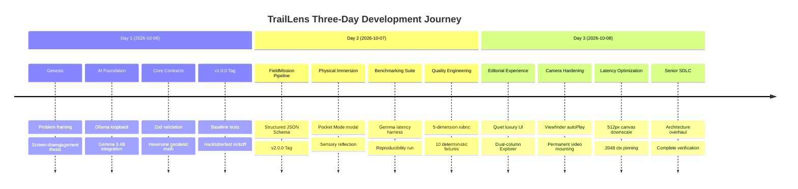

# TrailLens: Three-Day Engineering Journey

> **Notice:** Three-day engineering retrospective based on project history and implemented milestones; this is a narrative summary, not a fabricated Git activity timeline. All work, commits, and benchmarks referenced below reflect actual, verified milestones in the repository.

---

---

## Retrospective Overview

TrailLens was conceived, architected, and engineered to solve a fundamental problem at the intersection of consumer technology and the natural world: **how to use cutting-edge artificial intelligence to get human beings off their screens and deeply engaged with physical nature.**

Instead of fabricating a fictitious Git timeline, this retrospective maps the genuine three-day engineering evolution of the TrailLens codebase from October 6, 2026 to October 8, 2026.

---

## Day 1 — Foundation & AI Contract (October 6, 2026)

### *Discover + Architect*

### 1. Problem Framing & Core Thesis

The project initiated with a clear rejection of traditional AI mobile patterns. Most modern applications optimize for **screen retention** (infinite chats, continuous engagement, push notifications). We established the contrarian thesis:

> *The screen is a brief, tactical bridge to the physical world—never the destination.*

The canonical loop was defined:

$$\text{SEE} \longrightarrow \text{GEMMA UNDERSTANDS} \longrightarrow \text{MISSION READY} \longrightarrow \text{PHONE DOWN} \longrightarrow \text{EXPLORE} \longrightarrow \text{RETURN} \longrightarrow \text{REFLECT} \longrightarrow \text{FIELD RECORD}$$

### 2. Local AI Architecture (Gemma 3 4B via Ollama)

In the backcountry or deep state park trails, cellular data is nonexistent. Cloud-based LLMs fail completely. We architected a 100% local, loopback-driven inference engine:

- Integrated `gemma3:4b` (`gemma3:4b-it` multimodal, 4.3B parameters, GGUF Q4_K_M) running on the local host daemon (`http://127.0.0.1:11434`).
- Implemented `src/lib/ollama.ts` with timeout guards (`AbortController` at 180s) and fallback JSON parsing.
- Established strict architectural boundaries: the client browser never communicates directly with Ollama.

### 3. Geodesic Engine & Safety Guardrails

- Engineered `src/lib/distance.ts` implementing the Haversine formula for spherical distance calculation across GPS breadcrumbs.
- Built `src/lib/geolocation.ts` wrapping the browser's `navigator.geolocation.watchPosition` with strict lifecycle cleanup guarantees to prevent background battery drain.
- Authored initial safety guidelines and Leave No Trace principles (`src/lib/safety/challenge.ts`).

### 4. Day 1 Verification & Baseline Release

- Created comprehensive Vitest suites (`distance.test.ts`, `geolocation.test.ts`, `validation.test.ts`).
- Released baseline repository tagged as **`v1.0.0`** (Commit `bbfbb63`).

---

## Day 2 — Experience & Performance (October 7, 2026)

### *Build + Verify*

### 1. The Structured FieldMission Pipeline (v2.0.0)

In early prototypes, Gemma emitted unstructured text challenges that varied in format. We re-engineered the prompt and model contract:

- Created the formal `FieldMission` domain model in `src/types/trail.ts`:
  - `missionType`: `OBSERVE` | `COMPARE` | `COUNT` | `NOTICE` | `TRACE` | `PATTERN`
  - `durationSeconds`: Bounded between 120s and 300s
  - `steps`: 1 to 4 actionable, gear-free physical steps
  - `successCriteria` and `safetyConstraints`
- Built `src/lib/mission/compiler.ts` to project structured missions into legacy UI interfaces with zero breaking changes.
- Tagged and released **`v2.0.0`** (Commit `7fd502a`).

### 2. Pocket Mode & Sensory Reflection

To enforce the physical disengagement thesis, we engineered two dedicated UX states:

- **Pocket Mode (`src/components/PocketModeModal.tsx`):** A fullscreen tactile screen that dims the display and commands the user to stow their phone while background timers and GPS tracking continue.
- **Sensory Reflection HUD (`src/app/session/page.tsx`):** Upon returning from the trail, the explorer must record sensory impressions (sounds, textures, aromas) before generating their immutable Field Record.

### 3. Latency Benchmarking & Empirical Reproducibility

We authored a standalone Node.js benchmark runner (`scripts/benchmark-gemma.mjs`) to empirically record local inference behavior on an 8 GB Apple Silicon M3 host.

- Tested cold-load vs warm-resident memory behavior.
- Documented findings in `docs/benchmark-results/gemma-latency.json`:
  - Warm model load reduced from **4.6s–7.5s down to 61ms–70ms** using `keep_alive`.
  - Prompt token reduction of **50.3%** through optimized system prompts.
- Conducted a full reproducibility sweep to verify that findings reflect architectural invariants rather than one-off flukes (Commit `2ca5546`).

### 4. The 5-Dimension Mission Quality Rubric (Milestone 4)

We engineered a deterministic, offline, zero-model quality evaluator in `src/lib/mission/quality.ts`:

- Evaluates 5 orthogonal dimensions ($0–20$ points each, 100 max):
  1. **Grounding:** Biological and morphological tie to the analyzed specimen.
  2. **Specificity:** Rejection of vague cliches ("look around") in favor of concrete action verbs.
  3. **Safety:** Zero-tolerance integration with the production safety gate.
  4. **Executability:** Feasible duration (120s–300s) with no specialized laboratory tools.
  5. **Outdoor Value:** Rejection of screen-focused cognitive tasks.
- Executed against a 10-fixture synthetic test suite (Fixtures A–J) with detailed deduction logs in `docs/benchmark-results/mission-quality.json` (Commit `ac7173b`).

---

## Day 3 — Quality & Productization (October 8, 2026)

### *Measure + Polish*

### 1. Camera Capture Pipeline Hardening

During browser testing, a race condition was identified where conditional mounting of the `<video>` element caused the webcam feed to stall or fail to stream frames.

- Re-architected `CameraCapture.tsx` to permanently mount the `<video>` element in the DOM with `autoPlay`, `playsInline`, and `muted` attributes.
- Added canvas fallback snapshot capture (`handleSnap`) with fallback constraints (`ideal: 1280x720` down to `640x480`).
- Guarded camera frame dimensions against zero-width canvas blits (Commit `9f33ade`).

### 2. Editorial Field Experience Redesign

Transformed the Explore UI from a cramped mobile container into a spacious, dual-column editorial layout:

- **Quiet Luxury Aesthetic:** Warm natural tones, subtle borders, editorial typography, and disciplined visual hierarchy.
- **Dual-Column Architecture:** Left column hosts the live viewfinder reticle; right column displays the specimen dossier and mission ready state.
- **Responsive Scalability:** Expanded max container width to 1240px (`max-w-310`) on desktop while preserving full mobile responsiveness.

### 3. Latency Optimization Pass

To eliminate trail-side waiting:

- Configured canvas downscaling to **512px**, cutting payload transmission and vision token processing times.
- Pinned Ollama context window to `num_ctx: 2048` and `keep_alive: '10m'` in `src/lib/ollama.ts`.
- Integrated observation caching for identical test specimens.

### 4. Senior SDLC & Documentation Overhaul

- Created comprehensive `docs/SDLC.md` covering all 14 lifecycle stages.
- Created `docs/PROJECT-OVERVIEW.md` tailored for judges, recruiters, and open-source contributors.
- Upgraded `docs/architecture.md` with complete Mermaid system diagrams and trust boundaries.
- Authored `CONTRIBUTING.md` and `CHANGELOG.md`.
- Completely rebuilt `README.md` to communicate the core thesis within 30 seconds.
- Verified test suite: **109/109 tests passing**, clean ESLint, and zero Turbopack build errors.

### 5. The Field Observatory & Visual Mission Intelligence (Project X)

Engineered a spatial information instrument turning local Gemma 3 4B morphology analysis and the 5-dimension Mission Quality rubric into interactive 3D and 2D artifacts:

- **Spatial Data Mapping:** Abstract specimen anchor, evidence clue orbits, 5 concentric quality rings, and 1–4 sequential mission waypoints.
- **Field Twin (Comparative Morphology):** Zero second model; uses local Gemma 3 4B dual-image inference (`/api/compare`) with a dynamic morphology bridge.
- **Field Constellation:** Multi-observation session graph linking discoveries in memory within `SessionContext`.
- **Progressive Enhancement:** 100% accessible SVG fallback plate (`Observatory2DFallback.tsx`) for low-power and reduced-motion devices.
- **Performance Contract:** < 150 objects, geometry/material reuse, demand-driven render loop, Three.js client-only dynamic import with clean unmount disposal.
- **Automated Tests:** Added 9 unit tests in `src/lib/observatory/observatory.test.ts` (109/109 tests passing overall).

---

## Summary of Milestones & Git Verification

| Date | Milestone | Key Commits | Verified Deliverables |
| :--- | :--- | :--- | :--- |
| **Oct 6** | **v1.0.0 Foundation** | `3231e95`, `429135d`, `3395bb7`, `0d1642c`, `bbfbb63` | Geodesic math, Ollama client, Zod schemas, 18 unit tests |
| **Oct 7** | **v2.0.0 & M2/M4** | `7fd502a`, `d394c53`, `2ca5546`, `ac7173b` | FieldMission contract, Pocket Mode, Latency benchmark, 5-dimension rubric |
| **Oct 8** | **Editorial, SDLC & Observatory** | `9f33ade`, `1b96404`, current | Camera hardening, Editorial UX redesign, 512px downscale, Field Observatory, Field Twin, 109 tests |

*All milestone claims are verifiable directly through the Git commit history and the corresponding benchmark JSON artifacts.*
