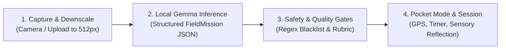

# TrailLens: Comprehensive Project Overview

> **Tagline:** *Look beyond the screen.*
> **Event:** Hacktoberfest 2026 — Open-Source AI Challenge (Week 1: *Touch Grass*)
> **Target Category:** Partner Category — **Best Use of Gemma**
> **Core Concept:** Local AI Field-Experiment Engine

---

```text
              TRAILLENS
         LOOK BEYOND THE SCREEN

                 SEE
                  │
                  ▼
        ┌──────────────────┐
        │   GEMMA 3 4B     │
        │  LOCAL INFERENCE │
        └────────┬─────────┘
                 │
                 ▼
        ┌──────────────────┐
        │  FIELD MISSION   │
        │ QUALITY + SAFETY │
        └────────┬─────────┘
                 │
                 ▼
             PHONE DOWN
                 │
                 ▼
          REAL WORLD
          EXPLORATION
                 │
                 ▼
            REFLECTION
                 │
                 ▼
           FIELD RECORD
```

---

## 1. What is TrailLens?

TrailLens is an open-source, local-first web application designed for hikers, field naturalists, and curious outdoor explorers.

Instead of acting as a traditional chatbot or an encyclopedic identification engine that traps your eyes on a screen, TrailLens acts as a **Local AI Field-Experiment Engine**. It analyzes a photograph of a natural specimen (a leaf, tree bark, a stone, or a wildflower) and immediately issues a **tactile, real-world Field Mission**—commanding you to put your phone in your pocket, explore your physical surroundings for 2 to 5 minutes, and return only to reflect and log your sensory findings.

---

## 2. What Problem Does It Solve?

### The Screen-Retention Trap
Modern digital products are engineered around engagement loops: infinite feeds, push notifications, and dopamine hits designed to maximize daily active minutes. When people take their smartphones onto trails, state parks, and nature reserves, mainstream nature apps inadvertently recreate this dynamic:
- Users spend minutes staring at complex taxonomic keys on a glass screen.
- Users take a photo, read a Wikipedia summary, and immediately check social media.
- The connection to the living, physical forest is severed.

### The Wilderness Connectivity Void
Real nature does not have reliable 5G cell towers. Most deep trails, canyon floors, and national parks are complete cellular dead zones. Cloud-dependent AI applications (such as ChatGPT, Claude, or proprietary identification APIs) fail entirely the moment you step off the trailhead parking lot.

**TrailLens solves both:** It requires **zero cloud connection** to run its multimodal AI, and its entire interaction design is engineered to **force you to put the phone away**.

---

## 3. Why Does This Need AI?

A simple static checklist or random challenge generator cannot adapt to what an explorer is actually looking at:
- If you photograph a **smooth river pebble**, asking you to "examine leaf venation" is nonsensical.
- If you photograph a **fungal growth on pine bark**, you need contextual clues about lichen symbiosis, moisture gradients, and tree bark textures.

Multimodal artificial intelligence provides the bridge: it interprets the exact visual morphology of the captured specimen and synthesizes a relevant, grounded field mission tailored specifically to that specimen's physical context.

---

## 4. Why Gemma 3 4B?

Google's **Gemma 3 4B** (`gemma3:4b-it`) is uniquely suited for this mission:
1. **Multimodal Native Reasoning:** Gemma 3 processes images and text natively, recognizing fine visual structures such as lobed leaf cuticles, lichen crusts, quartz mineral banding, and conifer scale morphology.
2. **Compact Edge Footprint:** At ~4.3 billion parameters (quantized to ~3.3 GB in GGUF Q4_K_M), Gemma 3 runs comfortably within the memory limits of consumer laptops and edge hardware without requiring multi-GPU server clusters.
3. **Structured JSON Output:** Gemma 3 follows complex structured schemas, reliably generating our typed `FieldMission` data contracts.
4. **Open-Weight Transparency:** Complete open weights allow developers and researchers to audit prompt handling, verify privacy claims, and run the model completely offline without API keys or token billing.

---

## 5. Why Local Inference?

| Dimension | Cloud AI APIs | Local Gemma Inference (TrailLens) |
| :--- | :--- | :--- |
| **Backcountry Availability** | Fails with zero cellular bars | **100% operational in deep wilderness** |
| **Privacy & Location Security** | Sends photos and GPS to third parties | **Zero telemetry; data never leaves device** |
| **Operational Costs** | Monthly API bills and token rate limits | **Free forever; open-source and self-hosted** |
| **Vendor Independence** | Risk of model deprecation or policy shifts | **Permanent open-weight local autonomy** |

---

## 6. How Does the System Work?

The TrailLens loop operates across four distinct technical stages:



1. **Capture & Preprocessing:** The explorer frames a specimen in the camera viewfinder. The client-side HTML5 canvas downscales the frame to 512px at 0.80 JPEG quality to eliminate unnecessary memory overhead.
2. **Local Inference:** The Next.js API route (`/api/analyze`) dispatches the image via internal loopback HTTP to the local Ollama daemon hosting Gemma 3 4B.
3. **Safety & Quality Interception:** The raw model output is validated against Zod schemas, audited by a deterministic production safety gate, and evaluated against a 5-dimension quality rubric.
4. **Physical Immersion & Reflection:** The user triggers "Pocket Mode," stores the device, walks the trail with background GPS logging, and returns to record a sensory reflection before generating an immutable Field Record.

---

## 7. What Makes TrailLens Different?

```text
Traditional Nature Apps:
Photo ──────> Cloud Server ──────> Taxonomy Dump ──────> Keep Staring at Screen

TrailLens:
Photo ──────> Local Gemma ──────> Field Mission ──────> Put Phone Away ──────> Explore Nature
```

- **Not an AI Chatbot:** No conversational distractions. One photo yields one structured observation and one timed outdoor challenge.
- **Not a Social Network:** No leaderboards, no follower counts, no algorithmic engagement bait.
- **Not a Black-Box Cloud Wrapper:** Everything executes locally, deterministically, and privately.

---

## 8. Safety Philosophy: Zero-Tolerance Deterministic Guardrails

In the outdoors, bad AI advice can be fatal. Large language models are prone to hallucinations and must **never** be trusted to self-regulate wilderness safety.

TrailLens enforces a **deterministic production safety gate** (`src/lib/safety/challenge.ts`) downstream of Gemma:
- **No Ingestion / Foraging:** Tasting, eating, or tactile harvesting of wild mushrooms, berries, or plants is strictly blocked.
- **No Physical Peril:** Commands involving steep drop-offs, cliffs, swift currents, or climbing are intercepted.
- **Wildlife Protection:** Touching, cornering, feeding, or handling fauna is prohibited.
- **Leave No Trace:** Specimen collection or branch tearing is forbidden.

If any hazard pattern is detected, the challenge is intercepted, an audit warning is recorded, and a guaranteed safe observational fallback is substituted.

---

## 9. Mission Quality: Measurable & Auditable

In Milestone 4, TrailLens introduced an automated, deterministic **5-Dimension Mission Quality Rubric** (`src/lib/mission/quality.ts`):
1. **Grounding (0–20 pts):** Is the mission directly anchored to the observed specimen?
2. **Specificity (0–20 pts):** Does it provide concrete, observable actions instead of vague filler ("explore the area")?
3. **Safety (0–20 pts):** Does it pass the production safety gate with Leave No Trace adherence?
4. **Executability (0–20 pts):** Is the duration bounded (120s–300s) and doable without lab gear?
5. **Outdoor Value (0–20 pts):** Does it require real-world physical immersion rather than screen memorization?

---

## 10. Engineering Evidence & Truthful Metrics

In accordance with our absolute truthfulness standard, TrailLens reports only measured, reproducible facts:

- **Automated Test Suite:** **100 / 100 tests passing** in under 1.5 seconds across 9 test files.
- **Model Residency Optimization:** Using `keep_alive: '10m'`, warm model load latency drops from **4.6s–7.5s down to 61ms–70ms** on an Apple M3 host.
- **Prompt Token Savings:** Optimized system prompt instructions achieve a **50.3% token reduction** (1,019 tokens down to 506 tokens).
- **Mission Quality Benchmark:** 10 deterministic test fixtures scored an average of **85.4 / 100**, with Specificity correctly identified as the most demanding dimension (60.0% pass rate).

---

## 11. Known Limitations

We are transparent about current engineering boundaries:
1. **Hardware Requirements:** Local 4B multimodal inference requires an Apple Silicon Mac or a machine with a capable CPU/GPU and 8GB+ of RAM.
2. **Inference Latency:** Multimodal inference takes 25 to 55 seconds depending on host load; it is not instantaneous.
3. **Heuristic Spatial Vision:** The vision module uses color-clustering and spatial bounding heuristics, not full deep semantic segmentation.
4. **Field Environment Reality:** Offline rubric benchmarks verify structural contracts; true pedagogical value requires ongoing real-world human trail testing.

---

## 12. Future Roadmap

1. **Native On-Device Mobile Runtime:** Port the inference pipeline to Apple CoreML and Android ExecuTorch to run natively on mobile phones without a host laptop.
2. **Audio-First Trail Mode:** Voice-narrated missions delivered via Bluetooth earbuds to keep the screen in your pocket from start to finish.
3. **Decentralized Field Records:** Allow explorers to sync observation records over peer-to-peer protocols (e.g., Nostr or IPFS) to open biodiversity databases without centralized tracking.
