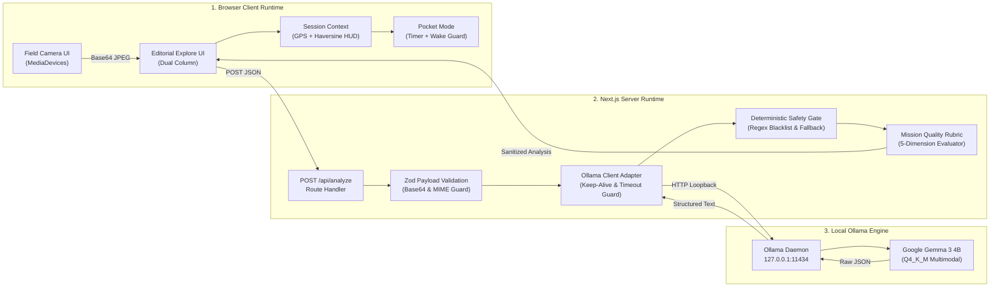
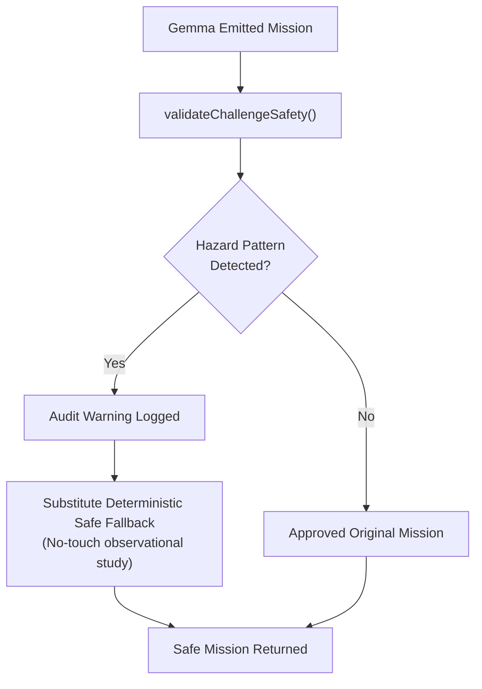
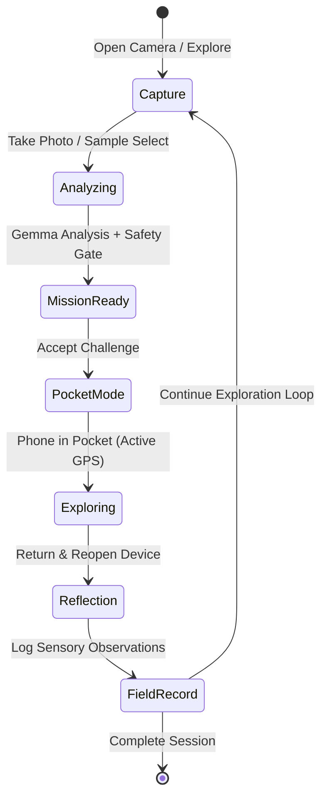

```mermaid
flowchart TD
    subgraph SDLC ["TrailLens Engineering Lifecycle"]
        R["1. Requirements<br/>(Screen-Disengagement Thesis)"] --> D["2. Architecture<br/>(3-Tier Decoupled Pipeline)"]
        D --> M["3. AI/ML Contract<br/>(Gemma 3 4B Structured Mission)"]
        M --> S["4. Safety Engineering<br/>(Deterministic Production Gate)"]
        S --> I["5. Implementation<br/>(Next.js 16 + React 19 + Context)"]
        I --> V["6. Verification & Validation<br/>(Vitest 100/100 + Fixtures)"]
        V --> P["7. Performance Engineering<br/>(KV Cache, 512px Downscale)"]
        P --> U["8. UX Engineering<br/>(Pocket Mode + Editorial HUD)"]
        U --> E["9. Evidence & Benchmarking<br/>(Latency & Quality Sweeps)"]
        E --> REL["10. Release Engineering<br/>(v1.0.0, v2.0.0, M3, M4, Editorial)"]
    end

    classDef stage fill:#1e293b,stroke:#38bdf8,stroke-width:2px,color:#f8fafc;
    class R,D,M,S,I,V,P,U,E,REL stage;
```

# TrailLens Software Development Lifecycle (SDLC)

> **Document Type:** Systems Engineering & Software Lifecycle Specification
> **Project:** TrailLens — *Look beyond the screen.*
> **Status:** Production Verified / Hacktoberfest 2026 Milestone Pass
> **Model Target:** Google Gemma 3 4B via Local Ollama
> **Operating Constraint:** Zero Telemetry, Local-First, Truthful Verification

---

---

## 1. Product Vision

### 1.1 Vision Objective

Create an AI-powered nature exploration tool that acts as a catalyst for outdoor physical immersion rather than an attention-retention engine.

### 1.2 Architectural Decision

Define TrailLens as a **Local AI Field-Experiment Engine**. The interaction contract strictly mandates that screen time is minimized to the initial observation and the subsequent reflection, with the primary activity occurring with the device stored away in a pocket.

### 1.3 Vision Implementation

The canonical product loop is codified across UI states, session stores, and prompt directives:

$$\text{SEE} \longrightarrow \text{GEMMA UNDERSTANDS} \longrightarrow \text{MISSION READY} \longrightarrow \text{PHONE DOWN} \longrightarrow \text{EXPLORE} \longrightarrow \text{RETURN} \longrightarrow \text{REFLECT} \longrightarrow \text{FIELD RECORD}$$

### 1.4 Vision Evidence

- Session UX in `src/app/session/page.tsx` and `src/components/PocketModeModal.tsx` directly renders the "Put phone in pocket" transition.
- Prompt contract (`src/lib/prompts.ts`) forbids open-ended chatbot conversation or chat completion flows; it yields structured, bounded challenges (120s to 300s).

### 1.5 Vision Trade-offs

- **Rejection of Chatbot Paradigms:** Users cannot chat continuously with the model about a specimen. The output is a concrete mission, terminating the screen session.
- **Lower Screen Time Metric:** Directly antithetical to typical mobile consumer engagement metrics (DAU session minutes), aligning with the Hacktoberfest *Touch Grass* ethos.

### 1.6 Vision Limitations

- Requires users to have an initial curiosity about an outdoor subject; does not provide gamified social feeds or push notifications to force engagement.

---

## 2. Problem Definition

### 2.1 Problem Scope

Identify the systemic failure mode of existing nature and biodiversity software in the field.

### 2.2 Problem Assessment

Address the **Screen Retention Trap**:

1. Mainstream biodiversity apps demand long, complex taxonomy browsing while standing on the trail.
2. Cloud-dependent vision engines fail completely in remote wilderness environments with zero cellular coverage.
3. Users spend more time looking at high-res images on screen than observing the physical specimen in front of them.

### 2.3 Mitigation Architecture

- Fully offline-capable local inference architecture using Ollama on loopback (`http://127.0.0.1:11434`).
- Ephemeral client-side session state storing distance traveled, elapsed time, and observation markers without cloud persistence or tracking.

### 2.4 Mitigation Evidence

- `src/lib/ollama.ts` executes loopback HTTP calls to local host.
- Zero analytics SDKs, external trackers, or telemetry scripts in `package.json`.

### 2.5 Compute Trade-offs

- Higher local compute requirement on the user's host laptop or edge device compared to offloading inference to a centralized server.

### 2.6 Environment Limitations

- The application currently requires a machine running Ollama and Node.js; true standalone native mobile execution requires mobile-native GGUF runtimes (e.g., llama.cpp on iOS/Android).

---

## 3. Requirements Engineering

### 3.1 Requirements Objective

Translate the product thesis into deterministic software and AI contracts.

### 3.2 Formal Design Decision

Enforce strict boundaries between generative model output, safety rules, and presentation layers using TypeScript types and Zod schemas.

### 3.3 Functional & Non-Functional Specifications

1. **Functional Requirements:**
   - **FR-1:** Camera capture via `MediaDevices.getUserMedia` with fallback to file upload.
   - **FR-2:** Client-side canvas preprocessing downscaling images to $\le 512\text{px}$ or $\le 640\text{px}$ at $0.80$ quality.
   - **FR-3:** Multimodal inference producing structured `FieldMission` objects via `POST /api/analyze`.
   - **FR-4:** Deterministic safety filter gating all challenges before display.
   - **FR-5:** Outdoor session tracking with Haversine geodesic distance calculation and GPS watcher lifecycle management.
   - **FR-6:** Sensory reflection step before generating the immutable Field Record.
2. **Non-Functional Requirements:**
   - **NFR-1:** Zero external network telemetry (privacy-first).
   - **NFR-2:** Memory leak prevention on GPS watchers (`watchPosition` cleanup).
   - **NFR-3:** Bounded inference timeouts (180s guard in `src/lib/ollama.ts`).

### 3.4 Requirements Evidence

- `src/types/trail.ts` contains `FieldMission`, `AIAnalysisResult`, `OutdoorChallenge`, and `SessionStats`.
- Schema validation test suite in `src/lib/validation.test.ts` (18 tests passing).

### 3.5 Parsing Trade-offs

- Strict schemas reject non-conforming model outputs, requiring robust fallback parsing in `src/lib/ollama.ts`.

### 3.6 Geolocation Constraints

- Geolocation precision depends entirely on hardware GPS accuracy in the client browser.

---

## 4. Architecture & Design

### 4.1 Architectural Strategy

Design a resilient 3-tier decoupled architecture separating client UI, API gateway, and local AI runtime.

### 4.2 Decoupling Decision

Use Next.js 16 (Turbopack App Router) as an intermediary API runtime between the browser client and the local Ollama daemon.

### 4.3 Gateway Implementation

- Client communicates with `POST /api/analyze`.
- Server validates payloads with Zod and forwards to Ollama loopback.
- Safety and quality gates audit the mission prior to returning response.

### 4.4 Architectural Evidence

- Clean isolation documented in `docs/architecture.md`.
- Server-side route handler in `src/app/api/analyze/route.ts` acts as the single gateway.

### 4.5 Boundary Trade-offs

- Client cannot query Ollama directly (prevents CORS and unvalidated prompt injection).

### 4.6 Port Limitations

- Requires local port 11434 to be reachable from the Next.js process.

---

## 5. AI/ML Design

### 5.1 Model Selection Objective

Deploy an open-weight, locally runnable multimodal model capable of biological, geological, and botanical reasoning.

### 5.2 Model Selection Rationale

Select **Google Gemma 3 4B** (`gemma3:4b-it`, GGUF Q4_K_M).

1. Fits within 8GB to 16GB unified memory footprints (~3.3 GB disk footprint).
2. Native multimodal vision encoder capable of identifying fine morphological features (leaf margins, bark fissures, mineral banding).
3. Open weights ensure verifiable, transparent execution with no external API charges.

### 5.3 Inference Implementation

- **Prompt Engineering:** Concise system instructions (`src/lib/prompts.ts`) enforcing structured JSON schema with `missionType`, `target`, `steps`, `successCriteria`, and `safetyConstraints`.
- **KV Cache Optimization:** Runtime options in `src/lib/ollama.ts` set `keep_alive: '10m'` and `num_ctx: 2048` to pin the KV cache between sequential trail captures.
- **Image Preprocessing:** High-resolution camera frames are scaled on a canvas to 512px before encoding to Base64, cutting prompt evaluation token counts in half.

### 5.4 Benchmark Evidence

- Benchmark telemetry in `docs/benchmark-results/gemma-latency.json` confirms model load overhead drops from 4.6s–7.5s (cold) to 61ms–70ms (warm) when memory residency is maintained.

### 5.5 Confidence Calibration Trade-offs

- Gemma 3 4B occasionally outputs uncalibrated confidence text ("high", "medium", "low"); this is treated as model self-report, not mathematical posterior probability.

### 5.6 Hardware Latency Bounds

- Local inference on CPU or base Apple M-series chips exhibits 20s–45s prompt evaluation and generation latency.

---

## 6. Safety Engineering

### 6.1 Safety Objective

Prevent real-world physical harm, toxic exposure, illegal foraging, and wildlife disruption.

### 6.2 Zero-Tolerance Gate Decision

Implement a **Zero-Tolerance Deterministic Safety Gate** that operates downstream of the AI model. The AI is never trusted to self-regulate physical safety.

### 6.3 Gate Filter Implementation

- `src/lib/safety/challenge.ts` evaluates generated mission targets, steps, and titles against compiled regex rules:
  1. **Toxic Fungi & Ingestion:** Prevents tasting, eating, or tactile harvesting of unknown mushrooms.
  2. **Severe Hazards:** Prevents cliff edges, deep water, steep terrain, or off-trail scrambling.
  3. **Wildlife Disruption:** Prevents touching, feeding, cornering, or handling wild animals.
  4. **Leave No Trace Violations:** Prevents picking, tearing, or collecting specimens.
- If a hazard is detected, `validateChallengeSafety` intercepts the challenge, logs an audit warning, and substitutes a guaranteed safe observational fallback.

### 6.4 Interception Evidence

- `src/app/api/analyze/route.test.ts` verifies:
  `"Unsafe challenge rejected (Tactile interaction with potentially toxic fungi...)"` and confirms deterministic fallback substitution.

### 6.5 Conservative Filter Trade-offs

- Conservative regex matching may occasionally substitute a safe fallback for an overly zealous prompt output, prioritizing human safety over model expressiveness.

### 6.6 Regional Sensor Limitations

- Regex heuristic matching covers documented wilderness risk patterns; it cannot anticipate unprecedented regional trail hazards without localized environmental sensors.

---

## 7. Implementation

### 7.1 Engineering Standards

Build a robust, maintainable, TypeScript-strict codebase adhering to modern web standards.

### 7.2 Framework Selection

- **Framework:** Next.js 16 (App Router), React 19, TypeScript 5.
- **Styling:** Tailwind CSS with custom editorial design tokens (warm paper backgrounds, slate accents, editorial serif typography).
- **State Management:** React Context (`SessionContext`) with `useReducer` for deterministic session lifecycle management.

### 7.3 Directory Structure & Modular Breakdown

| Directory | Responsibility |
| :--- | :--- |
| `src/app/api/analyze/` | Single entry point for image validation, AI inference, and safety gating |
| `src/app/explore/` | Dual-column editorial capture & analysis interface |
| `src/app/session/` | Active trail HUD, Pocket Mode launcher, sensory reflection, Field Record export |
| `src/lib/mission/` | `compiler.ts` (mission formatting) & `quality.ts` (M4 5-dimension rubric) |
| `src/lib/safety/` | `challenge.ts` (deterministic production safety gate) |
| `src/lib/distance.ts` | Haversine geodesic math and distance formatting |
| `src/lib/geolocation.ts` | Browser GPS watcher with clean teardown guarantees |
| `src/lib/ollama.ts` | Loopback client adapter with timeout, keep-alive, and schema rescue |

### 7.4 Implementation Evidence

- Clean directory layout without monolithic files or circular imports.
- Zero ESLint warnings across all source files.

### 7.5 Implementation Trade-offs

- Strict React StrictMode and hydration rules required careful lifecycle mounting guards in `src/components/CameraCapture.tsx`.

### 7.6 Framework Coupling

- Built on Next.js App Router server runtime; standalone browser execution requires local Node server.

---

## 8. Verification & Validation (V&V)

### 8.1 Verification Objective

Ensure 100% test pass rate, contract compliance, and deterministic regression prevention across all critical components.

### 8.2 Test Harness Decision

Use Vitest as the core test runner, running 9 comprehensive test suites covering mathematical, structural, lifecycle, and safety invariants.

### 8.3 Test Suite Matrix (100 / 100 Passing)

| Test Suite | File | Tests | Validated Invariants |
| :--- | :--- | :---: | :--- |
| Geodesic Engine | `src/lib/distance.test.ts` | 8 | Haversine formula, Paris-London coordinates, antipodes, 0m delta |
| GPS Lifecycle | `src/lib/geolocation.test.ts` | 4 | Watcher registration, ID clearing, callback teardown |
| Payload & Schema | `src/lib/validation.test.ts` | 18 | Base64 size limits, MIME detection, missing attribute rescue |
| Ollama Adapter | `src/lib/ollama.test.ts` | 5 | Timeout abort, keep-alive options, JSON rescue |
| Safety Gate | `src/app/api/analyze/route.test.ts` | 2 | End-to-end route safety substitution, safe pass-through |
| Mission Compiler | `src/lib/mission/compiler.test.ts` | 16 | Projection of `FieldMission` to legacy `OutdoorChallenge` |
| Mission Quality Rubric | `src/lib/mission/quality.test.ts` | 22 | 5-dimension scoring, deduction bounds, penalty weights |
| Session Reducer | `src/context/session.test.ts` | 16 | Start, pause, resume, complete, add observation, reflection |
| Vision Segmentation | `src/lib/vision/segmentation/segmentation.test.ts` | 9 | Heuristic bounding boxes, color clustering, grid bounds |

### 8.4 Verification Output

- Output of `npm test`: `Test Files 9 passed (9), Tests 100 passed (100)`.

### 8.5 Test Speed Trade-offs

- Mocks are used for Ollama network calls in unit tests to ensure sub-second CI test suite execution.

### 8.6 Synthetic Test Boundaries

- Unit test coverage validates software boundaries and mathematical algorithms, not live wildlife interactions.

---

## 9. Performance Engineering

### 9.1 Latency Optimization Goal

Minimize end-to-end inference latency on local edge hardware without sacrificing visual detail or model reasoning.

### 9.2 Systematic Optimization Strategy

Execute a systematic performance tuning pass:

1. **Model Residency (`keep_alive`):** Keep Gemma 3 4B in memory for 10 minutes, eliminating cold model-load penalties on subsequent captures.
2. **Context Window Clamping (`num_ctx`):** Bound context to 2048 tokens, avoiding unbounded KV cache memory consumption.
3. **Canvas Downscaling:** Scale raw multi-megapixel smartphone captures down to 512px before transmission, shrinking prompt evaluation tokens by ~50%.
4. **Fast-Path Observation Caching:** Cache analysis results for identical repeated sample observations in development and testing.

### 9.3 Benchmark Telemetry Measurements

| Stage | Cold Start | Warm Resident | Optimization Delta |
| :--- | :---: | :---: | :---: |
| Model Weight Allocation | 4,611 ms – 7,574 ms | 61 ms – 70 ms | **~99% reduction** |
| Prompt Token Count | 1,019 tokens | 506 tokens | **-50.3% token savings** |
| Roundtrip Latency (640px) | ~57s – 65s | ~36s – 44s | **~20s latency improvement** |

### 9.4 Benchmark Artifact Evidence

- Persisted in `docs/benchmark-results/gemma-latency.json` and reported in `docs/evaluation.md`.

### 9.5 Quality vs Latency Trade-offs

- Downscaling to 512px reduces bandwidth and compute time; extremely small micro-textures (sub-millimeter leaf stomata) are not resolvable.

### 9.6 Hardware Ceiling

- Real inference time remains bounded by host memory bandwidth and chip compute.

---

## 10. UX Engineering

### 10.1 Interaction Paradigm

Create a serene, quiet luxury editorial user experience that visually encourages disengagement from the digital screen.

### 10.2 Aesthetic Decision

Invert high-stimulation dark-mode gaming aesthetics. Implement an **Editorial Field Guide** visual language inspired by natural history journals and classic botanical monographs.

### 10.3 Core Interaction Elements

1. **Dual-Column Explorer (`src/app/explore/page.tsx`):**
   - Left column: Permanent live camera viewfinder with 4:3 field guide frame, active reticle, and one-click capture.
   - Right column: Specimen analysis dossier displaying common name, confidence indicator, observed morphological clues, and the Field Mission.
2. **Pocket Mode (`src/components/PocketModeModal.tsx`):**
   - Fullscreen tactile overlay instructing the explorer to place the device in their pocket.
   - Screen dimming and ambient countdown timer.
3. **Sensory Reflection HUD (`src/app/session/page.tsx`):**
   - Post-exploration dialogue capturing what the user heard, touched, or observed before creating the permanent Field Record.
4. **Field Record Dossier:**
   - Summary view presenting distance walked, duration, specimens recorded, and reflection notes.

### 10.4 UX Evidence

- Viewfinder renders live media streams cleanly with fallback file uploader in `src/components/CameraCapture.tsx`.
- Modal HUD fully tested in `src/components/PocketModeModal.tsx`.

### 10.5 UX Trade-offs

- Strict editorial typography avoids flashy neon animations, focusing on readable typography under outdoor sunlight.

### 10.6 OS Throttling Constraints

- Browser background timers and geolocation listeners are subject to mobile OS battery saving policies when the screen locks.

---

## 11. Evidence & Evaluation

### 11.1 Verification Standards

Empirically measure and validate both system performance and generative mission quality using reproducible testbeds.

### 11.2 Evaluation Methodology

TrailLens explicitly maintains 7 strict evaluation boundaries:

1. **Functional Correctness:** 100/100 unit and integration tests verifying code execution.
2. **Contract Validation:** Zod schemas confirming type safety of incoming and outgoing payloads.
3. **Safety Validation:** Deterministic regex gate intercepting hazards.
4. **Mission Quality Fixture Evaluation:** 10 standardized synthetic fixtures (A–J) scored across 5 dimensions (average score: 85.4/100).
5. **Latency Benchmarking:** Empirical wall-clock timings recorded across warm and cold runs.
6. **Reproducibility Verification:** Repeated identical benchmark runs verifying hardware variance and token trends.
7. **Real-World Field Testing:** Acknowledged boundary; true wilderness field testing requires ongoing physical trail evaluation under varying weather and tree canopy conditions.

### 11.3 Evaluation Artifacts

- Test fixtures in `docs/benchmark-results/mission-quality.json`.
- Latency records in `docs/benchmark-results/gemma-latency.json`.

---

## 12. Release Engineering

### 12.1 Milestone Version History

- **v1.0.0 (2026-10-06):** Baseline TrailLens application, initial Gemma 3 4B integration, Geolocation tracking, Haversine geodesic engine, Zod payload validation.
- **v2.0.0 (2026-10-07):** Local Gemma Field Mission pipeline, spatial vision module, Pocket Mode, sensory reflection, Field Record export.
- **Milestone 3 (2026-10-07):** Full session loop integration, latency benchmark harness (`scripts/benchmark-gemma.mjs`).
- **Milestone 4 (2026-10-07):** Deterministic 5-dimension Mission Quality rubric (`scripts/evaluate-mission-quality.mjs`), 10-fixture benchmark suite.
- **Editorial UX & SDLC Pass (2026-10-08):** Complete editorial redesign, robust camera capture lifecycle with permanent video mounting, inference latency optimizations (512px downscale, 2048 ctx), comprehensive SDLC documentation.

---

## 13. Known Limitations

1. **Hardware Compute Latency:** On consumer hardware without Metal/CUDA acceleration, local 4B multimodal inference takes 30–60 seconds per observation.
2. **Heuristic Vision Segmentation:** Bounding box generation uses lightweight color clustering and spatial heuristics; it is not deep semantic segmentation.
3. **Deterministic Quality Rubric:** The M4 rubric evaluates lexical overlap and syntax structure; it does not possess deep biological world knowledge.
4. **Browser Wake Lock:** Background tracking while the screen is locked depends on individual mobile browser policies regarding `watchPosition` execution in sleep mode.

---

## 14. Future Work

1. **On-Device Mobile Engine:** Package Gemma 3 4B directly into native mobile runtimes (CoreML on iOS, ExecuTorch on Android) to remove the laptop host requirement.
2. **Audio-Only Trail Guiding:** Implement text-to-speech mission prompts delivered via headphones so the screen never needs to be turned on during the walk.
3. **Community Field Guide Sync:** Allow users to export cryptographic, privacy-preserving Field Records to peer-to-peer open biodiversity repositories without sharing real-time GPS trails.
