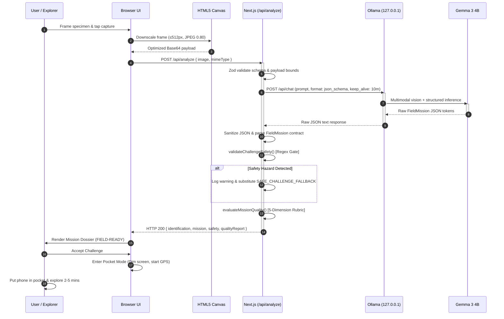
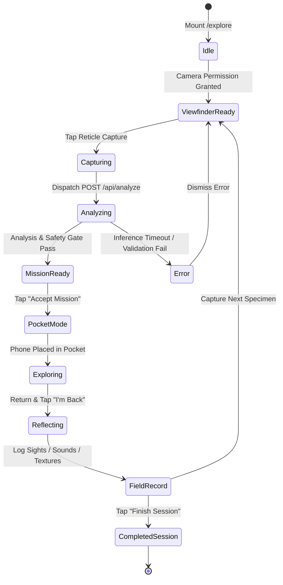
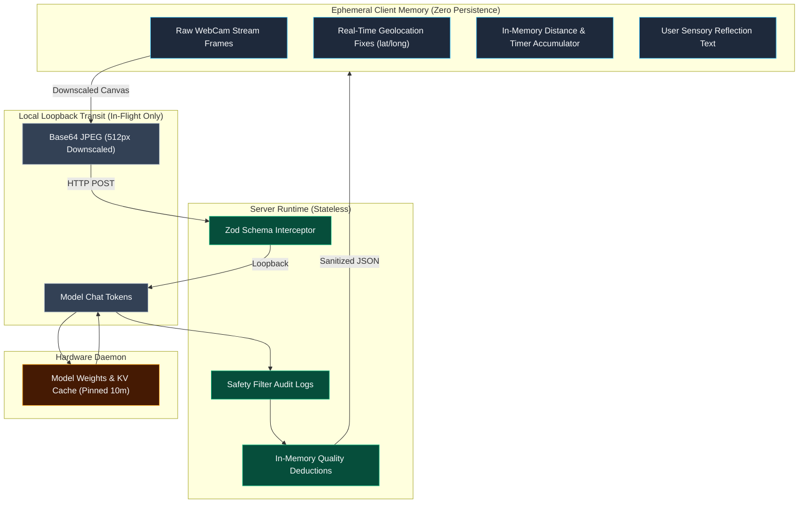
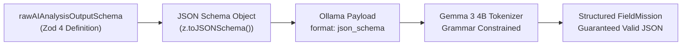
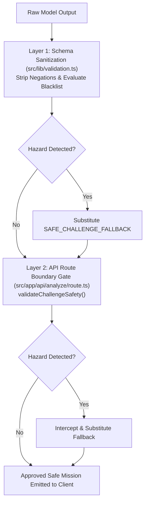

# TrailLens Architecture & Technical Specification

> **Project Name:** TrailLens
> **Tagline:** Look beyond the screen.
> **Hacktoberfest 2026 Track:** Open-Source AI Challenge — Week 1 (*Touch Grass*)
> **Target Category:** Best Use of Gemma
> **Architecture Pattern:** 3-Tier Decoupled Local-First AI Engine

---

## 1. Architectural Philosophy & Product Loop

TrailLens is an outdoor-first AI companion engineered around a single contrarian thesis: **the screen is a temporary bridge, never the destination**.

Modern consumer mobile applications prioritize engagement loops, infinite feeds, and persistent screen retention. TrailLens inverts this paradigm by using local, open-weight multimodal artificial intelligence to rapidly interpret nature observations and immediately command the explorer to put their device away.

```text
              TRAILLENS
         LOOK BEYOND THE SCREEN

                 SEE
                  │
                  ▼
        ┌──────────────────┐
        │   GEMMA 3 4B     │
        │  LOCAL INFERENCE │
        └────────┬─────────┘
                 │
                 ▼
        ┌──────────────────┐
        │  FIELD MISSION   │
        │ QUALITY + SAFETY │
        └────────┬─────────┘
                 │
                 ▼
             PHONE DOWN
                 │
                 ▼
          REAL WORLD
          EXPLORATION
                 │
                 ▼
            REFLECTION
                 │
                 ▼
           FIELD RECORD
```

---

## 2. System Architecture & C4 Container Model

The architecture is partitioned into three strictly decoupled runtime containers: **Client Browser Runtime**, **Next.js Server Runtime**, and the **Local Ollama Daemon**.

### 2.1 System Architecture Diagram

```mermaid
flowchart TB
    subgraph Browser ["1. Client Browser Runtime (Ephemeral State)"]
        direction TB
        CAM["Field Camera UI<br/>(MediaDevices / Canvas Scale)"]
        EXP["Editorial Explore UI<br/>(Viewfinder + Dossier)"]
        SESS["SessionContext Provider<br/>(GPS Watcher + Haversine)"]
        POC["Pocket Mode Modal<br/>(Tactile Timer + HUD)"]
        REF["Sensory Reflection HUD<br/>(Sight, Sound, Texture)"]
        REC["Field Record Dossier<br/>(Immutable Walk Summary)"]

        CAM --> EXP
        EXP --> SESS
        SESS --> POC
        POC --> REF
        REF --> REC
    end

    subgraph Server ["2. Next.js Server Runtime (Stateless Gateway)"]
        direction TB
        API["POST /api/analyze<br/>Route Handler"]
        VAL["Zod Payload Validation<br/>(MIME & Base64 Guard)"]
        ADAPT["Ollama Client Adapter<br/>(Timeout, Keep-Alive, Rescue)"]
        SAFE["Deterministic Safety Gate<br/>(Challenge Interceptor)"]
        QUAL["Mission Quality Rubric<br/>(5-Dimension Evaluator)"]

        API --> VAL
        VAL --> ADAPT
        ADAPT --> SAFE
        SAFE --> QUAL
    end

    subgraph Daemon ["3. Local Ollama Engine (Hardware Isolated)"]
        direction TB
        OLL["Ollama Daemon<br/>(127.0.0.1:11434)"]
        GEM["Google Gemma 3 4B<br/>(gemma3:4b-it Q4_K_M)"]

        OLL --> GEM
    end

    EXP ==>|HTTP POST JSON (Base64)| API
    ADAPT ==>|HTTP Loopback| OLL
    GEM ==>|Structured JSON| ADAPT
    QUAL ==>|Sanitized FieldMission Result| EXP

    classDef client fill:#1e293b,stroke:#38bdf8,stroke-width:2px,color:#f8fafc;
    classDef server fill:#0f172a,stroke:#10b981,stroke-width:2px,color:#f8fafc;
    classDef daemon fill:#18181b,stroke:#f59e0b,stroke-width:2px,color:#f8fafc;

    class CAM,EXP,SESS,POC,REF,REC client;
    class API,VAL,ADAPT,SAFE,QUAL server;
    class OLL,GEM daemon;
```

---

## 3. End-to-End Sequence Diagram

The interaction lifecycle begins with a tactile specimen capture and cleanly resolves through safety and mission quality evaluation before activating the outdoor immersion loop.



---

## 4. User Journey & State Machine



---

## 5. Data Lifecycle & Trust Boundaries

TrailLens is architected with strict, explicit boundaries separating memory scopes, transport layers, and persistence guarantees:



### Boundary Guarantees
1. **The Browser Never Communicates with Ollama Directly:** All requests route through `POST /api/analyze` to enforce schema constraints, guard against payload abuse, and avoid exposing local network ports.
2. **Ephemeral Geolocation:** Geolocation coordinates are never stored in browser `localStorage`, cookies, or indexedDB, and are never transmitted to any server. When the browser tab closes, all trail traces are erased from memory.
3. **Zero Third-Party Telemetry:** No external tracking scripts, cloud analytics, or closed API tokens exist in the runtime.
4. **Air-Gapped Operation:** When running locally, the entire application functions with airplane mode enabled.

---

## 6. Data Contracts & Type Definitions

Domain contracts are enforced at compile time via TypeScript and at runtime via Zod schemas (`src/types/trail.ts` & `src/lib/validation.ts`).

### 6.1 Primary Domain Model (`src/types/trail.ts`)

```typescript
export type AIConfidence = 'low' | 'medium' | 'high';

export type MissionType =
  | 'OBSERVE'
  | 'COMPARE'
  | 'COUNT'
  | 'NOTICE'
  | 'TRACE'
  | 'PATTERN';

export interface FieldMission {
  missionType: MissionType;
  title: string;
  target: string;
  durationSeconds: number; // Bounded: 120 <= duration <= 300
  steps: string[];          // Bounded: 1 <= steps <= 4
  successCriteria: string;
  safetyConstraints: string[];
}

export interface AIAnalysisResult {
  identification: string;
  confidence: AIConfidence;
  uncertaintyReason?: string;
  evidence: string[];
  description: string;
  observation: string;
  mission?: FieldMission;   // Canonical structured contract
  challenge: string;        // Backward-compatible projection
  safety: string;
  inferenceDurationMs?: number;
  qualityReport?: MissionQualityReport;
}

export interface GeoPoint {
  latitude: number;
  longitude: number;
  timestamp: number;
  accuracy?: number;
}

export interface SessionStats {
  elapsedSeconds: number;
  totalDistanceMeters: number;
  observationsCount: number;
  completedChallengesCount: number;
  explorationScore: number;
}
```

---

## 7. Multimodal AI Integration (Gemma 3 4B)

### 7.1 Model Selection & Resource Footprint
- **Model:** Google Gemma 3 4B (`gemma3:4b-it`, GGUF Q4_K_M).
- **Footprint:** ~3.3 GB disk footprint, ~4.3B parameter footprint.
- **Multimodal Visual Reasoning:** Emits structured morphological clues over botanical cuticles, conifer scales, quartz mineral banding, and lichen crusts.
- **Memory Residency (`keep_alive`):** Pinned in host unified memory using `keep_alive: '10m'` and `num_ctx: 2048` to prevent multi-second cold load penalties.

### 7.2 Structured JSON Schema Generation
Gemma 3 4B outputs structured JSON conforming to `rawAIAnalysisOutputSchema`. This schema compiles via Zod into standard JSON Schema passed directly in the Ollama request payload (`format: json_schema`).



---

## 8. Safety Engineering: Two-Layer Defense-in-Depth

The safety gate operates downstream of the generative model. Generative AI is treated as an untrusted agent regarding physical safety.



### Safety Categories Intercepted
1. **Toxic Fungi & Foraging:** Tasting, eating, picking, or tactile handling of mushrooms or unknown berries.
2. **Terrain Peril:** Commands to approach cliff edges, deep water, waterfalls, steep scree slopes, or off-trail ravines.
3. **Wildlife Contact:** Touching, feeding, approaching, or cornering wild animals.
4. **Conservation / Leave No Trace:** Uprooting flora, snapping branches, or disturbing soil habitats.

---

## 9. Geolocation & Geodesic Engine

### Haversine Formula (`src/lib/distance.ts`)
Calculates the great-circle distance between consecutive GPS coordinates on Earth (mean radius $R = 6,371,000$ meters):

$$a = \sin^2\left(\frac{\Delta\phi}{2}\right) + \cos(\phi_1)\cos(\phi_2)\sin^2\left(\frac{\Delta\lambda}{2}\right)$$
$$c = 2 \cdot \operatorname{atan2}\left(\sqrt{a}, \sqrt{1-a}\right)$$
$$d = R \cdot c$$

### Jitter Mitigation & Stationary Noise Filter
Raw mobile GPS hardware experiences positional drift even while the user is standing still. `calculateTrackDistance` applies a displacement threshold:
- Any coordinate delta $< 2.0\text{ meters}$ (`jitterThresholdMeters`) from the last accepted coordinate is rejected as noise.
- Non-finite coordinates (`NaN`, `null`, out-of-bound latitudes/longitudes) contribute 0 meters.

---

## 10. Failure Modes & Recovery Strategies

| Failure Mode | Trigger | System Behavior | Explorer Recovery |
| :--- | :--- | :--- | :--- |
| **Ollama Daemon Unreachable** | Port 11434 down / Ollama stopped | Next.js catches connection error; logs diagnostic | Clean error card; prompt to run `ollama serve` |
| **Model Weight Eviction** | System under memory pressure | Cold load penalty incurred (~4.6s–7.5s) | Progressive loading status indicates warm-up |
| **Inference Timeout** | Host compute stalled (>180s) | `AbortController` triggers timeout signal | Request aborted; error presented to explorer |
| **Malformed Model Output** | Token truncation or stray markdown | `attemptJsonRescue()` strips fences & balances brackets | Recovers valid fields or falls back to schema defaults |
| **Dangerous AI Mission** | Model suggests foraging / steep climbs | Safety gate flags pattern match | Silently substituted with safe observation mission |
| **Camera Access Denied** | User blocks webcam permission | Browser rejects `getUserMedia` promise | Fallback file uploader appears with specimen presets |
