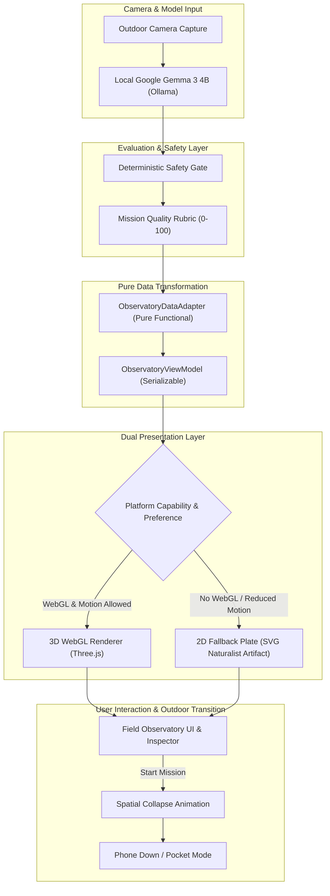

# The Field Observatory

> **A Spatial Information Instrument for Local Edge AI**  
> *"The 3D scene is data. It turns Google Gemma 3 4B’s invisible reasoning into a physical naturalist artifact before the phone goes back into your pocket."*

---

## 1. Product Concept & Philosophy

TrailLens is an offline-first, local-AI field experiment engine designed to connect people with the natural world. Its canonical loop is:

```text
SEE → GEMMA UNDERSTANDS → VISUALIZE → MISSION READY → PHONE DOWN → EXPLORE → RETURN → REFLECT → FIELD RECORD
```

**The Field Observatory** is a spatial visualization layer that manifests the AI's internal reasoning as a living information artifact. It is designed around the visual language of a **naturalist field notebook**, a **scientific observatory**, and an **editorial data sculpture**.

### The Core Principle: The 3D Scene is Data

The Observatory is strictly non-decorative:

* **Center Anchor**: Abstract morphology representation of the specimen (leaf, bark, flower, stone, pine cone) categorized deterministically by subject semantics.
* **Evidence Nodes**: Visual clues extracted directly from Gemma’s multimodal grounding (e.g., lobed margins, pinnate veins, ridged texture) orbiting at distinct spatial coordinates.
* **Quality Rings**: Five concentric brass and stone rings mapped 1:1 to TrailLens's deterministic Mission Quality rubric (Grounding, Specificity, Safety, Executability, Outdoor Value).
* **Mission Orbit & Waypoints**: The FieldMission steps (1 to 4 sequential actions) mapped as an elliptical orbit with physical waypoints.
* **Field Constellation**: Multi-observation session graph showing spatial connections between specimens discovered during the current outdoor outing.
* **Field Twin**: Dual-specimen comparative morphology bridge using local Gemma 3 4B.

---

## 2. Architecture & Data Flow

The visualization layer is fully decoupled from the core AI engine and domain state through a pure, serializable view model (`ObservatoryViewModel`). Three.js components never directly touch backend or raw state.



---

## 3. The Observatory View Model Contract

The data contract is defined in [`src/lib/observatory/types.ts`](file:///Users/suvendusahoo/triallens/src/lib/observatory/types.ts):

```typescript
export interface ObservatoryViewModel {
  subject: string;
  morphologyType: SpecimenMorphologyType; // 'leaf' | 'bark' | 'flower' | 'stone' | 'cone' | 'ambient'
  confidence: AIConfidence; // 'HIGH' | 'MEDIUM' | 'LOW'
  specimenDescription: string;
  observationPrompt: string;
  evidenceNodes: EvidenceNode[];
  qualityRings: QualityRingData[];
  qualityOverallScore: number;
  hasQualityReport: boolean;
  missionOrbit: MissionOrbitData;
  constellationNodes: FieldConstellationNode[];
  comparison?: FieldComparison;
}
```

### Deterministic Morphology Classification

The specimen anchor geometry in the center is deterministically selected based on specimen keywords without guessing:

* **Leaf**: Elliptical botanical geometry with central rib lines and gentle organic curvature.
* **Bark**: Layered cylindrical trunk segments with ridged contour lines.
* **Flower**: Radial 5-petal botanical structure with central stamen core.
* **Stone**: Faceted icosahedron with mineral fracture lines.
* **Cone**: Stepped spiral phyllotaxis disc structure.
* **Ambient**: Concentric orbital spheres for broader landscape subjects.

---

## 4. The Quality Rings System

TrailLens evaluates all generated missions using a deterministic 5-dimension rubric scored out of 100:

| Dimension | Role in Scene | Visual Attribute |
| :--- | :--- | :--- |
| **Grounding** | Ring 1 (Inner) | Radius: 1.4 + (score × 0.2), Opacity: 0.35–0.90 |
| **Specificity** | Ring 2 | Radius: 1.7 + (score × 0.2), Golden brass hue |
| **Safety** | Ring 3 | Radius: 2.0 + (score × 0.2), Forest emerald tint |
| **Executability** | Ring 4 | Radius: 2.3 + (score × 0.2), Line weight & dashes |
| **Outdoor Value** | Ring 5 (Outer) | Radius: 2.6 + (score × 0.2), Orbit distance |

If a quality report is absent, rings render in an understated neutral calibration state. No fake numbers are ever displayed.

---

## 5. Field Twin: Comparative Morphology

The Field Twin allows naturalists to capture a second specimen and invoke local Gemma 3 4B in a dual-image comparative mode.

### Schema Validation

```typescript
export interface FieldComparison {
  leftSubject: string;
  rightSubject: string;
  sharedFeatures: string[];
  differences: string[];
  uncertainty: string[];
  recommendedObservation: string;
}
```

* **Endpoint**: `/api/compare` running over loopback Ollama (`POST /api/generate` with Gemma 3 4B multimodal prompt).
* **Visual Representation**: The Observatory renders Specimen A on the left and Specimen B on the right, linked by a **Morphology Bridge**. Shared features cast botanical brass filaments; differences appear in muted earth tones.
* **Zero Second Model**: No external cloud APIs or secondary vision models are used.

---

## 6. Performance Engineering & Budgets

The 3D implementation adheres to strict production constraints:

1. **Object Budget**: Under 150 visible logical objects in the entire scene.
2. **Memory & Geometry**: Reused geometries (`TorusGeometry`, `SphereGeometry`, `CylinderGeometry`) and shared standard materials.
3. **Framerate Target**:
   * Desktop: 60 FPS target during interaction.
   * Mobile: 30 FPS target on supported mobile GPUs.
4. **Demand-Driven Rendering**: Animation pause toggle allows frozen state rendering. Continuous rendering stops when user leaves tab.
5. **Dynamic Client Import**: Three.js is loaded exclusively via Next.js `dynamic(..., { ssr: false })`. Zero impact on landing page Time to Interactive (TTI) or Server-Side Rendering (SSR).
6. **Complete Resource Disposal**: Scene listeners, animation frame IDs, geometries, and materials are systematically disposed of on unmount.

---

## 7. Progressive Enhancement & 2D Fallback

When WebGL is unavailable, when canvas contexts are restricted, or when the user has set `prefers-reduced-motion: reduce`:

1. The system automatically mounts [`Observatory2DFallback`](file:///Users/suvendusahoo/triallens/src/components/observatory/Observatory2DFallback.tsx).
2. The 2D fallback renders an editorial SVG field plate mirroring every data point:
   * Specimen silhouette with taxonomic label.
   * Concentric quality gauge bands with hoverable scorecards.
   * Evidence badge pills.
   * Sequential mission waypoints.
3. Users can also manually toggle between **3D Spatial Instrument** and **2D Field Plate** via the header switch.

---

## 8. Accessibility & Screen Reader Support

* **Full DOM Mirroring**: Every node, ring, and mission step visible in 3D has a semantic DOM equivalent in the collapsible **Naturalist Inspector Drawer**.
* **ARIA Live Regions**: Screen reader announcements for active node selection and mission status.
* **Keyboard Accessible**: All controls, modal toggles, and waypoints are reachable via standard Tab and Enter navigation.
* **Honest AI Notice**: Explicit disclaimers state that 3D geometries are illustrative spatial models derived from text observations, **not** photogrammetric 3D reconstructions.

---

## 9. Verification & Automated Test Suite

The Observatory is backed by deterministic unit tests in [`src/lib/observatory/observatory.test.ts`](file:///Users/suvendusahoo/triallens/src/lib/observatory/observatory.test.ts):

* Adapter translation from `FieldMission` to view model.
* Quality rubric mapping to ring radius, opacity, and geometry.
* Evidence string tokenization into 3D radial coordinates.
* Mission type mapping to orbital grammar.
* Waypoint extraction from mission steps.
* Constellation graph assembly from session history.
* Missing quality report graceful fallback.
* Dual-specimen comparison schema parsing.
